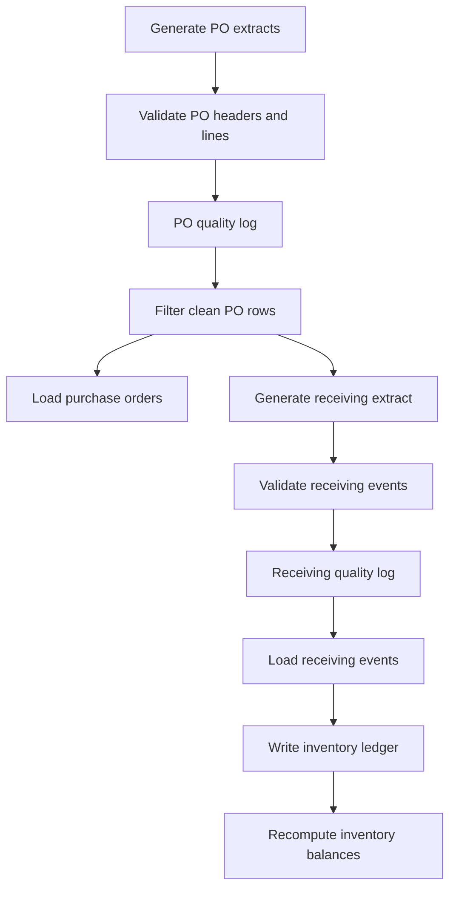

# ETL Design

## Purpose

This document defines the implemented Project Atlas ETL pipeline for purchase orders, receiving events, and inventory balances. It describes stage dependencies, data contracts, validation boundaries, database writes, and rerun behavior.

The Python modules under `python/` are the implementation source of truth. The pipeline is intentionally batch-oriented and uses CSV files to simulate extracts from procurement and warehouse source systems.

---

## Architecture



The validation logs act as quarantine manifests. Rows are not edited in place: raw data remains available for audit, rejected record identifiers are written to a log, and loaders insert only rows that are not flagged.

---

## Execution Context

Run Python commands from the `python/` directory because the configured data paths are relative to that directory and modules import `config`, `etl`, `validation`, and `utils` as top-level packages.

Requirements:

- Python 3.12 or later
- PostgreSQL
- Dependencies in `python/requirements.txt`
- Base schema, constraints, indexes, migration, and master-data seed scripts already applied
- Database connection variables configured in `python/.env`

Supported environment variables:

| Variable | Purpose | Default |
|---|---|---|
| `DB_HOST` | PostgreSQL host | `localhost` |
| `DB_PORT` | PostgreSQL port | `5432` |
| `DB_NAME` | Database name | None |
| `DB_USER` | Database user | None |
| `DB_PASSWORD` | Database password | None |
| `DB_SSLMODE` | PostgreSQL SSL mode | `prefer` |

`DB_SSLMODE=prefer` supports both local and SSL-capable cloud PostgreSQL. Environments that require encrypted connections should set `DB_SSLMODE=require`.

---

## Recommended Run Order

From `project-atlas/python/`:

```bash
python -m etl.generate_data
python -m validation.run_validation
python -m etl.load
python -m etl.generate_receiving_raw
python -m validation.run_receiving_validation
python -m etl.load_receiving
```

Then create or refresh the reporting views and refresh Power BI.

`generate_receiving_raw` reads clean raw purchase order rows and does not require a database connection. However, `etl.load` must complete before `etl.load_receiving`, because receiving events resolve `po_number` and `sku` to database `po_line_id` values.

---

## Stage 1 — Generate Purchase Order Extracts

**Module:** `etl.generate_data`

**Outputs:**

- `data/raw/purchase_orders_raw.csv`
- `data/raw/purchase_order_lines_raw.csv`

The generator produces source-style business keys rather than database surrogate IDs. Supplier names, PO numbers, and SKUs are resolved later during loading.

Generation is deterministic because Faker and Python random are seeded with `42`. Each run overwrites the prior raw CSVs. Approximately 15% of generated records receive a deliberate defect so validation and quarantine behavior can be demonstrated.

Purchase order header defects include:

- Duplicate PO number
- Missing supplier
- Unknown supplier
- Expected delivery before order date
- Blank status

Line defects include:

- Negative ordered quantity
- Received quantity greater than ordered quantity
- Unknown SKU
- Zero unit cost

---

## Stage 2 — Validate Purchase Orders

**Module:** `validation.run_validation`

**Inputs:** Purchase order header and line raw CSVs

**Output:** `data/processed/data_quality_log.csv`

The validator suite returns issue records rather than mutating or dropping source rows. Every issue contains:

- `record_id`
- `rule_id`
- `field`
- `value`
- `description`

Header issue identifiers use `po_number`. Line issue identifiers use `po_number:sku`.

Detailed rule definitions are maintained in `DATA_QUALITY_RULES.md`.

---

## Stage 3 — Establish the Clean-Row Contract

**Module:** `etl.clean_rows`

`get_clean_po_lines` is the shared definition of clean purchase order data. Both the purchase order loader and receiving generator call this function so downstream stages cannot silently disagree about which source rows passed validation.

Filtering rules:

- A flagged header is excluded.
- Every line belonging to a flagged header is also excluded.
- A flagged line is excluded without rejecting other clean lines on the same purchase order.
- Raw CSVs and quality logs must exist before filtering begins.

This shared contract is a key integrity control: receiving events cannot be generated from purchase order rows that the database loader rejected.

---

## Stage 4 — Load Purchase Orders

**Module:** `etl.load`

**Targets:**

- `purchase_orders`
- `purchase_order_lines`

The loader resolves source business keys to database surrogate keys:

| Source Key | Master Data Lookup | Target Key |
|---|---|---|
| `supplier_name` | `suppliers` | `supplier_id` |
| `sku` | `products` | `product_id` |
| `po_number` | Newly inserted `purchase_orders` | `po_id` |

The load runs inside a SQLAlchemy transaction. Purchase order headers are inserted individually to capture their generated `po_id`; clean lines are then bulk inserted.

Rows whose business keys fail to resolve are skipped. Unresolved suppliers produce a warning; unresolved product merges are excluded from the insert. Database constraints remain the final integrity boundary.

---

## Stage 5 — Generate Receiving Extracts

**Module:** `etl.generate_receiving_raw`

**Inputs:**

- Clean purchase order headers and lines
- Supplier reliability profiles from `config.profiles`
- Warehouse inspection-delay profiles from `config.profiles`

**Output:** `data/raw/receiving_events_raw.csv`

Only clean PO lines with `quantity_received > 0` produce receiving events. A supplier profile determines the probability of on-time delivery, partial receipts, damage, and rejection. A line may be split across one or two events.

For each event:

```text
gross received = accepted + damaged + rejected
```

The purchase order line's original `quantity_received` becomes the total accepted quantity across its generated events. Damaged and rejected quantities are additional physical units recorded at inspection and do not enter sellable inventory.

The generator uses natural keys (`po_number`, `sku`, `warehouse_code`) and injects approximately 15% deliberate receiving defects. Random generation is seeded for repeatability and the output CSV is overwritten on each run.

---

## Stage 6 — Validate Receiving Events

**Module:** `validation.run_receiving_validation`

**Input:** `data/raw/receiving_events_raw.csv`

**Output:** `data/processed/receiving_quality_log.csv`

Receiving record identifiers use `po_number:sku:event_number`. The validator checks quantity reconciliation, non-negative quantities, date logic, warehouse validity, and duplicate events.

---

## Stage 7 — Load Receiving and Rebuild Inventory

**Module:** `etl.load_receiving`

**Targets:**

- `receiving_transactions`
- `inventory_transactions`
- `inventory_balances`

The loader performs three operations in one database transaction:

1. Seed one `OPENING_BALANCE` ledger row for each existing warehouse-product balance that has no ledger history.
2. Insert clean receiving events and one `RECEIPT` ledger row for each event with accepted units.
3. Recompute `inventory_balances.quantity_on_hand` as the sum of all ledger deltas by warehouse and product.

Only `quantity_accepted` increases inventory. Damaged and rejected units remain on the receiving event for audit and quality reporting.

The resulting invariant is:

```text
inventory_balances.quantity_on_hand
    = SUM(inventory_transactions.quantity_delta)
      by warehouse_id and product_id
```

---

## Rerun and Idempotency Behavior

| Stage | Rerun Behavior |
|---|---|
| PO generation | Recreates the same deterministic CSV batch. |
| PO validation | Rewrites the quality log from the current raw files. |
| PO load | Skips `po_number` values already present in PostgreSQL. |
| Receiving generation | Recreates the same deterministic receiving CSV from the clean PO batch. |
| Receiving validation | Rewrites the receiving quality log. |
| Receiving load | Skips existing `(po_line_id, event_number)` pairs. |
| Opening-balance seed | Protected by ledger-history checks and a partial unique index. |
| Balance recomputation | Replaces balances with a full ledger sum rather than incrementing the prior snapshot. |

Idempotency applies to the implemented ETL stages, not to the base schema deployment scripts. `01_database_setup.sql` is destructive and should not be described as an idempotent migration.

---

## Failure and Recovery

- Missing raw files or quality logs stop the dependent stage with an actionable message.
- A database exception rolls back the active loader transaction.
- Quality failures quarantine rows; they do not stop the entire batch.
- Business-key resolution failures are skipped rather than inserted with invalid foreign keys.
- After correcting raw data or validation logic, rerun validation before rerunning a loader so the quarantine manifest reflects the current batch.

Because quality logs are CSV files, they provide batch evidence but not durable database observability. A future production design should add run identifiers, timestamps, row counts, statuses, and a database-backed issue table.

---

## Testing and CI

`python/tests/test_validators.py` contains 17 unit tests covering purchase order and receiving validators. GitHub Actions runs the suite with Python 3.12 on pushes and pull requests to `main`.

Run locally from `python/`:

```bash
python -m pytest -q
```

The current suite tests validation functions. It does not yet provide database integration tests for loader transactions, business-key resolution, ledger recomputation, or end-to-end rerun behavior.

---

## Current Boundaries

Version 0.5 does not include:

- A workflow scheduler or orchestration service
- Incremental extraction by watermark
- Retry or dead-letter processing
- Database-backed pipeline run history
- Schema validation for incoming CSV columns
- Integration tests against temporary PostgreSQL
- Cloud secrets management
- Automated Power BI refresh

These are future capabilities, not implied features of the current pipeline.